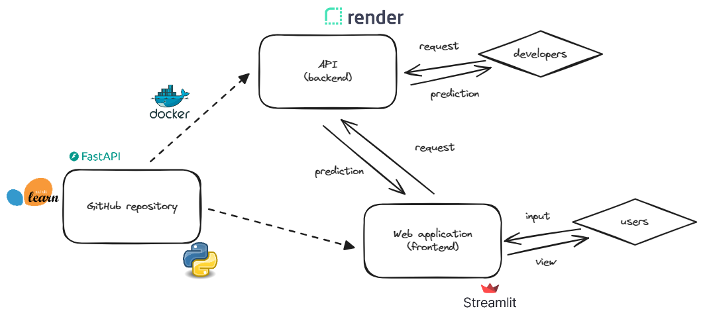

# Immo Eliza Predict - Model Deployment


## The Mission

For real estate company Immo Eliza, Harmony Real Estate has created an API and a small web application for web developers, non-technical employees and clients to access the predictions. The API and the web application are intertwined but separate.

## User guideline
Link to prediction site on Render: https://immo-eliza-predict.onrender.com/
On the left pane, select the step of the data science process (web deployment for most steps is still under construction).
Prediction:
-   enter parameters for the house you want a price estimation for
-   select a prediction model, or leave unchanged for all prediction models
-   click Submit for prediction


## Data collection:
Data collection script collects from Immoweb and returns 12000 records of houses and 48 columns. Scraping is done using asynchrone methods and concurrency.

## Data cleaning, feature engineering and preprocessing
After cleaning and preprocessing, 7206 records and 10 features were used to train the models.
Locality was used to determine proximity to major cities in Belgium (feature engineering, for example "has_assigned_city_10")
The features were: bedroom_count, net_habitable_surface, facade_count,land_surface, kitchen_type*, building_condition*, epc*, locality_code**, 'has_assigned_city_10',
       * *used as ordinal encoded categorical columns*
       ** converted to province, next province was onehotencoded
The (pre-)processing and modeller scripts ware coded using OOP. 

## Model building
House price prediciton is a regression model problem.
During training of the regression models, the best model and hyperparameters were identified and stored in pipelines for 3 categories:
best linear regression models,
best polynomial regression models,
best tree-based models.
These best model pipelines can be selected in the user interface.

## Prediction
Pipelines of the trained models are re-used for the house prediction on the new parameters from the use.

## Technical architecture

The architecture is a combination of :
-   FastAPI code, the API Dockerfile, and a Render account to deploy your backend API
-   streamlit code, and Streamlit Community Cloud account to deploy your frontend web application

The below diagram summarizes the whole architecture.
    

## 📦 Repo structure
```
Immo-Eliza-Predict/
├── README.md                           
├── fastapi_app.py                      # Main app file
├── streamlit_navigation.py             # Online 'home' page for navigation between modules of the Suite
└── dockerfile                          # To build image and deploy the app on render
└── requirements.txt                    # List of dependencies
└── pages/
    ├── collection.py                   # Data collection (i.e. scraping) page
    ├── data_cleaning.py                # Data cleaning page
    ├── exploratory_analysis.py         # Exploratory analysis page, visualizations and correlations come here
    ├── model_building.py               # Model building page, where models are trained, validated and performance is tested
    └── prediction.py                   # House price estimation page
└── trained_models/                     # Storage of trainined pipelines for use in predictions
└── utils/                              # Scripts for all the different steps
└── functions/                          # Accessory functions for all the different steps
```
## ⏱️ Timeline

The phase of the project to get the predictions online took 7 days for completion, for one because of going back to the beginning of the project and re-write code.

## 📌 Personal Situation
This project was done as part of the AI Bootcamp at BeCode.org. 
Connect with me on [LinkedIn](https://www.linkedin.com/in/tom-van-belle-b432bb9/).

